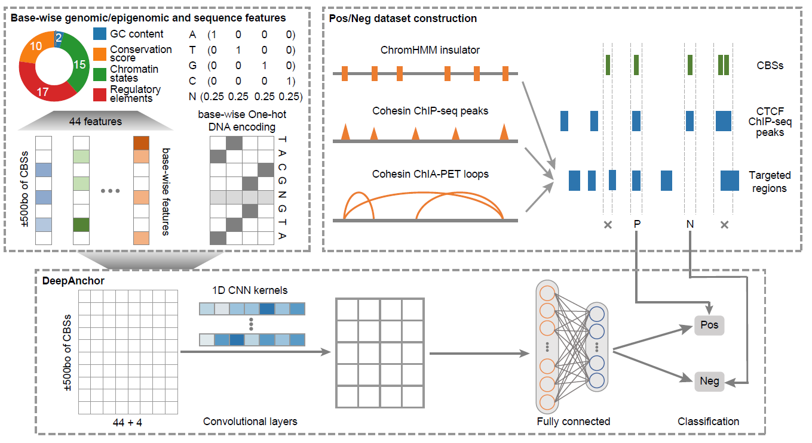

Welcome to LoopAnchor's documentation!
===================================

.. LoopAnchor documentation master file, created by
   sphinx-quickstart on Thu Sep 16 19:43:51 2021.
   You can adapt this file completely to your liking, but it should at least
   contain the root `toctree` directive.

LoopAnchor – Inferring CTCF insulators and anchored loops across human tissues and cell types.
===============================================================================================

.. toctree::
   :maxdepth: 1
   
   Pipeline
   

Overview
========
How CTCF recognizes insulators DNA sequence to exert chromosome barrier or enhancer blocking effects remains to be fully interrogated. Despite many computational tools were developed to predict CTCF-mediated loops qualitatively or quantitatively, few could specially evaluate the insulative regulatory potential of DNA sequence at CTCF binding sites (CBSs) and how it affects chromatin loop formation. Here, we developed a deep learning model, DeepAnchor, to precisely characterize predict the binding patterns insulative potentialfor different types of of CBSs. By incorporating base-wise genomic/epigenomic features, we revealed distinct chromatin and sequence features for CTCF-mediated insulation and looping at a high resolution, such as two sequence motifs flanking the core CTCF motif only at positive loop-associated CBSsCTCF insulators. Besides, we leveraged the predicted insulator anchor score to optimize the loop extrusion model and achieved the best performance in predicting CTCF-anchored loops. We established a compendium of context-specific CTCF-anchored loops across 52 human tissue/cell types and found that genomic disruption of CTCF-anchored loops may represent a general causal mechanism of disease pathogenesis. These computational models, together with the established resource, could facilitate the mechanistic research on how the CTCF-mediated cis-regulatory elements (CREs) insulation shapes context-specific gene regulation in cell development and disease progression.

Citation
========
Xu, Hang, et al. "Inferring CTCF insulators and anchored loops across human tissues and cell types." bioRxiv (2022).
